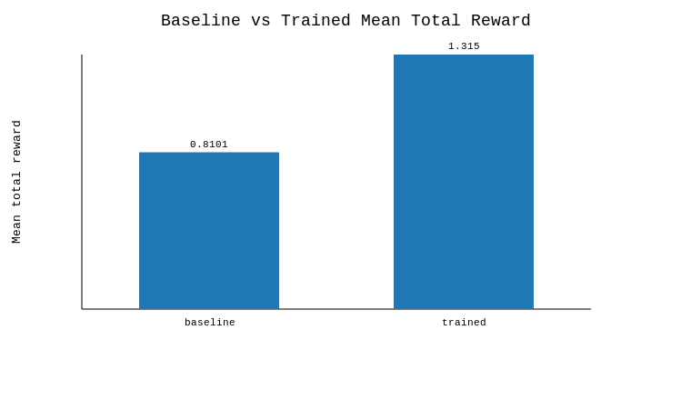
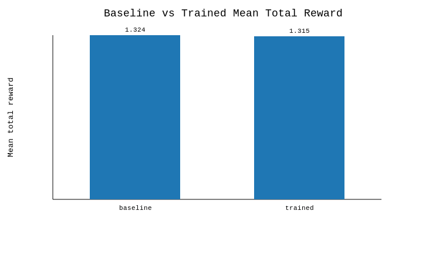
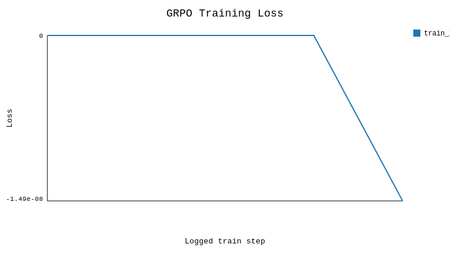
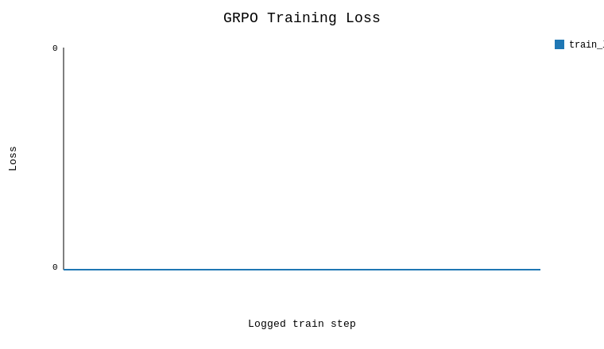

# RVEDA RCM ARENA

**RVEDA RCM ARENA** is an OpenEnv benchmark for training cautious medical coding agents under partial observability, schema rules, and policy drift.

In real revenue-cycle workflows, one-shot coding is unsafe; the agent has to reveal evidence, verify rules, adapt to changing claim requirements, and submit a grounded claim rather than guess from incomplete context.

## Quick Links

- `Live Space:` [`anirudw/rveda-rcm-arena`](https://huggingface.co/spaces/anirudw/rveda-rcm-arena)
- `Training Notebook:` [`train_generated_v2_grpo_launcher.ipynb`](https://colab.research.google.com/github/anirudw/rveda/blob/main/train_generated_v2_grpo_launcher.ipynb)
- `Training Script:` [`train_grpo_smoke.py`](train_grpo_smoke.py)
- `Reward/Loss Plots:` [Training Evidence](#training-evidence)
- `Blog:` [`Blog.MD`](Blog.MD)
- `Round 1 Baseline:` [`anirudw/rveda`](https://huggingface.co/spaces/anirudw/rveda)

## Why RVEDA RCM ARENA Matters

Medical coding is not just a classification task. In real revenue-cycle workflows, an agent has to work under incomplete evidence, evolving payer rules, and claim formatting constraints. A benchmark that rewards only the final code can easily reward the wrong behavior: unsupported specificity, shortcut retrieval, and submission without enough evidence.

RVEDA RCM ARENA is built to test the opposite behavior. The agent must reveal hidden chart evidence, search the ICD candidate space, inspect code details, check policy/schema requirements, and only then submit a grounded claim. That makes the benchmark more representative of professional work than a static label lookup task.

OpenEnv is the right fit because the problem is fundamentally an interaction loop, not a single forward pass. The environment needs structured actions, structured observations, explicit reward signals, and a clean server/client boundary that judges can rerun.

## Operational Loop

1. uncover hidden chart evidence from the EHR
2. search/select the correct code from a large candidate space
3. adapt to policy/schema drift and claim-format constraints
4. submit a valid grounded claim

## Distinctive Features

- **Fog-of-War EHR:** decisive evidence is hidden behind `QUERY_EHR` rather than visible at reset.
- **Policy/schema drift:** claim requirements can change mid-episode and the agent has to adapt.
- **Verifier-based cautious reward design:** the environment exposes structured reward metrics for correctness, grounding, schema compliance, format validity, process discipline, and drift adaptation.

Current state:

- the partial-observability and verifier mechanics are implemented
- the Colab training path is rerunnable
- the strongest current evidence is still smoke-level rather than large-scale training, but now shows a real completion-oriented gain over the scripted baseline

## Environment Overview

| Area | Current implementation |
| --- | --- |
| Action space | `SEARCH`, `DETAILS`, `QUERY_EHR`, `CHECK_POLICY`, `VALIDATE_CLAIM_SCHEMA`, `REASONING_LOG`, `SUBMIT` |
| Observation structure | patient note, search results, detailed info, `ehr_map`, revealed evidence, policy state, drift notice, reward metrics, error fields |
| Drift behavior | policy/schema drift can change required fields mid-episode |
| Success condition | submit the correct code with the required evidence and schema-valid workflow state |

## Training Setup

The current judge-facing training path is intentionally small-model first so it can be rerun in Colab instead of depending on one large-model attempt.

- Generated V2 Colab launcher: [`train_generated_v2_grpo_launcher.ipynb`](train_generated_v2_grpo_launcher.ipynb)
- Smoke Colab launcher: [`train_grpo_smoke_launcher.ipynb`](train_grpo_smoke_launcher.ipynb)
- Training runner: [`train_grpo_smoke.py`](train_grpo_smoke.py)
- Technical blog: [`Blog.MD`](Blog.MD)

Current setup:

- model used: `Qwen/Qwen2.5-1.5B-Instruct`
- trainer: TRL GRPO with a plain-TRL fallback path
- reward wiring: live environment reward through the training bridge, not a static offline label file
- evidence level: smoke-level but real, rerunnable, artifact-producing, and now strong enough to show a meaningful baseline comparison

Recommended order:

1. Sync the repo in Colab.
2. Run `python -m pytest -q`.
3. Run `openenv validate`.
4. Start with the small-model preset before attempting larger runs.
5. Confirm that the run produces saved artifacts under `artifacts/`.

## Results

Current primary smoke-run evidence:

| Run | Model | Tasks | Train steps | Mean total reward | `SUBMIT` count | Search-to-submission | Timeouts |
| --- | --- | --- | --- | --- | --- | --- | --- |
| Baseline policy | `Qwen/Qwen2.5-1.5B-Instruct` | `4` | `0` | `0.810125` | `4 / 8` | `3.25` | `0.5` |
| Trained policy | `Qwen/Qwen2.5-1.5B-Instruct` | `4` | `8` | `1.31500` | `8 / 8` | `1.0` | `0.0` |

Comparison summary:

| Metric | Value |
| --- | --- |
| Colab GPU | `Tesla T4` |
| Reward delta | `+0.504875` |
| Grounding F1 proxy delta | `-0.00654` |
| Interpretation | smoke-level improvement over the scripted baseline, driven mainly by higher submission completion and lower timeout rate |

Honest interpretation:

- This is real proof that training executed, produced artifacts, and improved end-to-end policy behavior on the current smoke evaluation.
- The trained 1.5B policy now completes `8 / 8` evaluation episodes with `SUBMIT`, while the scripted baseline only completes `4 / 8` and times out on half of them.
- This is still smoke-scale evidence, not a final performance claim: grounding is still measured through a proxy, and drift/schema headline metrics are not yet surfaced in the saved artifact summary.

## Training Evidence

Available verifier-facing metrics in the current run:

- grounding F1 proxy
- search-to-submission ratio
- timeout frequency
- trained-minus-baseline verifier deltas
- trainer-reported `train_loss`: `0.0` over `8` train steps

Metrics that are still early / unavailable in the current smoke run:

- drift adaptation rate
- schema validation pass rate

Most informative plots:


Phase 3 baseline-versus-trained reward comparison for the strongest current smoke run; the trained 1.5B policy materially outperforms the scripted baseline on completion-oriented behavior in this evaluation slice.


Earlier smoke-run reward comparison from the previous successful run; this helps show how the reward picture changed across iterations rather than only within the final Phase 3 result.


Training loss from the earlier successful smoke run; included here so the Phase 3 loss curve can be read as part of an iteration sequence rather than as a standalone plot.


GRPO training loss by logged training step for the current `Qwen/Qwen2.5-1.5B-Instruct` Colab run.

The Phase 3 verifier-metric plot is still included in the repo at `docs/plots/verifier_metrics_plot_p3.png`, but it is less visually informative than the reward and loss plots because the strongest changes are already captured more clearly by submission completion and timeout behavior.


## Reproduction

Quickstart:

- Install: `uv sync` or the Colab install cells in [`train_generated_v2_grpo_launcher.ipynb`](train_generated_v2_grpo_launcher.ipynb)
- Local run: `python -m pytest -q`, `openenv validate`, then run the training script or notebook
- Space run: use the linked Hugging Face Space above
- Colab rerun: start from the generated training notebook
- Artifact output location: `artifacts/`

## Repo Map

| Area | Path |
| --- | --- |
| Environment code | `server/rveda_environment.py`, `server/policy_engine.py`, `server/reward_engine.py` |
| Task generation | `generate_cases.py`, `examples/` |
| Training script | `train_grpo_smoke.py` |
| Notebook | `train_generated_v2_grpo_launcher.ipynb`, `train_grpo_smoke_launcher.ipynb` |
| Artifacts / plots | `artifacts/`, `docs/plots/` |
| Validation / utilities | `check-readiness.py`, `validate-submission.sh` |

## Limitations and Next Steps

Already proven:

- the OpenEnv environment is live and validated
- the Colab training path reruns on a `Tesla T4`
- the strongest current smoke run beats the scripted baseline on end-to-end completion and mean total reward
- reward, loss, and verifier artifacts are saved for review

Still early:

- the current result is still based on a small smoke evaluation rather than a broad curriculum
- grounding is still tracked through a proxy and regresses slightly in the strongest run
- drift adaptation rate and schema validation pass rate are not yet strong headline metrics in the saved smoke artifacts
- the current reward evidence is stronger than mere pipeline proof, but not yet large-scale learning evidence

Next steps:

- strengthen reward shaping and curriculum so the trained policy can preserve its completion gains while improving grounding quality
- expand generated tasks while keeping the Colab path rerunnable
- surface drift/schema metrics more clearly in the evaluation artifacts
- only then scale training beyond the small-model-first setup

## Business Context

Medical coding sits inside a much larger operational and financial surface area. In a [JAMA time-driven costing study](https://jamanetwork.com/journals/jama/fullarticle/2673148), billing and insurance-related activities were estimated at `$20` to `$215` per encounter and `3%` to `25%` of professional revenue, depending on encounter type, even in a large academic health system with a certified EHR. In Medicare Advantage, the [March 2024 MedPAC report](https://www.medpac.gov/document/chapter-13-estimating-medicare-advantage-coding-intensity-and-favorable-selection-march-2024-report/) estimated that Medicare would spend `22%` more for MA enrollees than comparable FFS beneficiaries in 2024, a projected `$83 billion` gap, with coding intensity alone projected to add about `$50 billion` in payments. A [2025 Health Affairs Scholar study](https://pubmed.ncbi.nlm.nih.gov/39822237/) found an enrollment-weighted mean coding inflation rate of `8.4%`, with `68.1%` of MA enrollees in contracts above Medicare's coding-intensity adjustment.

Those studies do not imply that a lightweight benchmark solves system-level payment integrity or administrative waste. They do support a narrower claim: diagnosis coding and billing workflow quality are financially material, and a benchmark that rewards grounded, cautious coding behavior is studying a real operational problem rather than a toy label task.

A benchmark that rewards only the final label risks training exactly the wrong behavior: hallucinating or overly aggressive agents that maximize apparent specificity without grounding. RVEDA RCM ARENA is designed to test the opposite behavior: grounded, stepwise coding decisions in which retrieval and verification are part of the task, not optional post-processing.

RVEDA RCM ARENA is designed to answer a concrete research question:

> Can an LLM agent behave like a cautious medical coder, rather than a one-shot label generator?

This framing matters for benchmark design:

- It tests **clinical reasoning**, not only label recall.
- It tests **search efficiency**, because the agent must retrieve and inspect evidence before submission.
- It penalizes **hallucinated or over-aggressive coding behavior** by making verification part of the interaction loop.
- It supports **human-in-the-loop auditing**, because each step leaves an explicit interaction trace.

## Market Context: Auditing vs. Benchmarking

Established platforms such as FraudLens, Cotiviti, and Optum FWA address a different layer of the problem: post hoc detection of fraud, waste, abuse, and anomalous billing behavior across large claims datasets.

RVEDA RCM ARENA addresses a different question. It is a **pre-deployment benchmark** for agentic medical coding systems, designed to test whether an AI model arrives at a code through grounded clinical reasoning before deployment.

That distinction is important. Statistical anomaly detection evaluates aggregate billing behavior across populations and claims streams; RVEDA RCM ARENA evaluates the reasoning trajectory of an individual AI agent as it searches, inspects evidence, and commits to an ICD-10 code. In that sense, RVEDA RCM ARENA is complementary to enterprise auditing systems: those platforms help catch problematic claims after the fact, while RVEDA RCM ARENA is designed to test whether an autonomous coding agent should be trusted before deployment.

## Benchmark Task

Each episode starts with a patient note and ends when the agent submits an ICD-10 code or exhausts the episode budget.

The action space is deliberately small and tool-like:

- `SEARCH(query)`: query the local ICD-10 index for candidate codes.
- `DETAILS(code)`: retrieve long-form code details and exclusion notes.
- `QUERY_EHR(module, query)`: reveal evidence from one hidden EHR module in the minimal Task 1.3 V2 slice.
- `CHECK_POLICY()`: reveal the active payer policy version and current claim-schema requirements.
- `VALIDATE_CLAIM_SCHEMA(payload)`: validate a draft claim against the active schema without ending the episode.
- `REASONING_LOG(payload)`: submit a grounded reasoning record that cites revealed evidence before final submission.
- `SUBMIT(code)`: finalize the coding decision and end the episode.

This setup mimics the operational logic of medical coding review: reveal hidden evidence when needed, retrieve candidates, inspect details, check the active claim rules, validate a draft claim, record grounded reasoning, then commit.

## Architecture

RVEDA RCM ARENA consists of three core layers: a local retrieval engine, an environment wrapper with grading logic, and a reference inference loop.

### 1. Local ICD-10 Engine: `server/engine.py`

`server/engine.py` is the retrieval backend used by the environment.

- `initialize_db()` creates `data/icd10.db` and seeds it from `icd10_mock.json`.
- The SQLite table stores `code`, `short_desc`, `long_desc`, and `excludes`.
- `search_codes(query, limit=5)` performs lexical retrieval over `short_desc` and `long_desc` using SQLite `LIKE` matching and returns compact candidate summaries.
- `get_code_details(code)` performs exact-code lookup and returns long description plus exclusion notes.

This design is intentionally simple and reproducible. The database is local, deterministic, and fast enough for benchmark-grade evaluation without introducing external search infrastructure.

### 2. Environment and Reward Logic: `server/rveda_environment.py`

`server/rveda_environment.py` wraps the engine in an OpenEnv-compatible task environment.

- On startup, it calls `initialize_db()` so the packaged SQLite database is ready before episodes begin.
- `reset()` loads a task from `tasks.json` and exposes the patient note as the initial observation.
- `step()` routes each action to the proper backend operation and returns structured observations containing search results, detailed code context, reward, and grading metadata.

The environment also records a rich `GradingTrace`, including:

- difficulty tier,
- search history,
- code inspection history,
- most recent search candidates,
- reward components,
- conflict flags such as `Excludes1` mismatches.

This makes RVEDA RCM ARENA useful not only for final-score benchmarking, but also for trajectory-level analysis of how an agent reasoned through the task.

### 3. Reference Inference Loop: `inference.py`

`inference.py` provides the benchmark submission loop.

At runtime it:

1. Reads task IDs from `tasks.json` or from `RVEDA_TASK` / `RVEDA_TASK_IDS`.
2. Creates an OpenAI-compatible client using `HF_TOKEN` (or `API_KEY`), `API_BASE_URL`, and `MODEL_NAME`.
3. Launches the environment with `RvedaEnv.from_docker_image(IMAGE_NAME)`.
4. Resets into an episode and builds a prompt from the current patient note, search results, detailed info, policy state, drift notice, reasoning-log status, and recent action history.
5. Asks the model to emit strict JSON with one of seven actions: `SEARCH`, `DETAILS`, `QUERY_EHR`, `CHECK_POLICY`, `VALIDATE_CLAIM_SCHEMA`, `REASONING_LOG`, or `SUBMIT`.
6. Executes the action in the environment, logs `[START]`, `[STEP]`, and `[END]` lines, and repeats until termination.

The loop is intentionally benchmark-friendly: it is deterministic in structure, OpenAI-client compliant, and emits normalized episode scores for consistent downstream evaluation.

## Benchmarking and Scoring

RVEDA RCM ARENA is designed around two measurable axes:

- **Accuracy**: did the agent submit the correct ICD-10 code, or at least the correct code family?
- **Efficiency**: how economically did the agent search, inspect, and commit within a bounded number of steps?

The environment also exposes rubric-level `reward_metrics` so terminal correctness, grounding, schema compliance, format validity, process discipline, and drift adaptation can be inspected independently.

### Accuracy Signal

Submission quality is the dominant grading signal.

- Exact-code submissions receive the highest base reward.
- Same-family submissions receive partial credit.
- Incorrect-family submissions receive a lower score.

This reflects a realistic coding hierarchy: selecting the right diagnostic family is better than an unrelated code, but full specificity still matters.

### Efficiency Signal

RVEDA RCM ARENA also scores process quality before submission.

- Novel, productive searches earn small bonuses.
- Relevant detail lookups earn additional reward.
- Repeated low-value exploration stops improving the score.
- Episodes are capped at **8 steps**, and failing to submit within budget ends the episode.

In benchmark terms, this acts as a **step penalty**: extra actions consume the fixed interaction budget, reduce the value of aimless search, and increase the risk of timing out before a valid `SUBMIT`. Faster, better-grounded coding trajectories therefore outperform slow or repetitive ones.

### Score Normalization

The final episode score reported by `inference.py` is normalized to a bounded 0-1 scale so tasks remain comparable across runs.

Episode rewards are standardized before reporting, which keeps evaluation stable while preserving relative ranking between stronger and weaker coding trajectories.

### Why the Scoring Design Matters

The benchmark therefore rewards:

- correct final coding decisions,
- efficient evidence gathering,
- auditable trajectories,
- compliance with strict evaluation contracts.

## Task Specification

Tasks are defined in `tasks.json` as JSON objects with four fields:

- `task_id`
- `difficulty`
- `patient_note`
- `target_code`

The current benchmark ships with a simple 3-tier structure:

| Tier | Example Task | Clinical Pattern | Target Code |
| --- | --- | --- | --- |
| Easy | `easy_endo_1` | Routine visit with elevated BMI and weight-management counseling | `E66.3` |
| Medium | `medium_endo_1` | Autoimmune hypothyroid presentation consistent with Hashimoto's disease | `E06.3` |
| Hard | `hard_cardio_1` | Acute myocardial infarction presentation in the emergency setting | `I21.9` |

This tiered task structure is useful for benchmarking both capability and scaling behavior: simple lexical retrieval may be enough on easy cases, while harder tasks require better grounding and more disciplined tool use.

## Setup

### Prerequisites

- Python 3.10+
- Docker
- `uv` or a compatible Python package installer

### 1. Install dependencies

```bash
uv sync
```

### 2. Initialize the local SQLite database

The environment initializes the database automatically at startup, but you can also prebuild it explicitly:

```bash
python -c "from server.engine import initialize_db; initialize_db()"
```

This creates `data/icd10.db` from the mock ICD-10 records in `icd10_mock.json`.

### 3. Build the environment image

```bash
docker build -t rveda-env:latest -f Dockerfile .
```

### 4. Optional: validate the environment

```bash
openenv validate
```

## Usage

### Run the server locally

```bash
uvicorn server.app:app --host 0.0.0.0 --port 8000
```

### Run the reference inference loop

Set the required environment variables first.

#### Bash

```bash
export API_BASE_URL="https://router.huggingface.co/v1"
export MODEL_NAME="Qwen/Qwen2.5-72B-Instruct"
export HF_TOKEN="<your_hf_token>"
export IMAGE_NAME="rveda-env:latest"
python inference.py
```

#### PowerShell

```powershell
$env:API_BASE_URL = "https://router.huggingface.co/v1"
$env:MODEL_NAME = "Qwen/Qwen2.5-72B-Instruct"
$env:HF_TOKEN = "<your_hf_token>"
$env:IMAGE_NAME = "rveda-env:latest"
python inference.py
```

Optional task controls:

- `RVEDA_TASK=<task_id>` runs a single task.
- `RVEDA_TASK_IDS=<task_a,task_b,...>` runs a selected task set.

During execution, `inference.py` prints benchmark-compatible logs in the form:

```text
[START] task=<task_name> env=<benchmark> model=<model_name>
[STEP] step=<n> action=<action> reward=<0.00> done=<true|false> error=<msg|null>
[END] success=<true|false> steps=<n> score=<score> rewards=<r1,r2,...>
```

## Repository Layout

- `server/engine.py`: SQLite-backed ICD-10 retrieval and detail lookup
- `server/rveda_environment.py`: environment state machine and reward shaping
- `server/app.py`: FastAPI / OpenEnv server wrapper
- `client.py`: client interface for interacting with the environment
- `models.py`: action, observation, and grading schemas
- `inference.py`: OpenAI-client baseline loop
- `tasks.json`: benchmark task suite
- `icd10_mock.json`: mock ICD-10 source data
- `data/icd10.db`: generated SQLite database used at runtime; created locally and not committed
- `docs/rveda-v2-contract.md`: frozen V2 Task 0.1 schema and verifiability contract
- `examples/v2_task_minimal.json`: minimal V2 curriculum slice example

## Scope and Limitations

RVEDA RCM ARENA is a **benchmarking environment**, not a production clinical coding system.

- The current ICD-10 corpus is mock data.
- Retrieval is lexical and SQLite-backed rather than semantic or ontology-scale.
- The SQLite backend is an intentional benchmark constraint: it keeps the environment local, deterministic, lightweight, and reproducible while forcing agents to reason under limited search conditions.
- The included agent loop is a baseline, not a claim of clinical deployment readiness.

Those constraints are a feature, not a flaw: they keep the benchmark controlled, portable, and easy to reproduce while still exercising the core reasoning loop of agentic medical coding.

## Research Use Cases

RVEDA RCM ARENA is well suited for:

- benchmarking LLM agents on coding accuracy under constrained search,
- comparing single-agent and multi-agent coding strategies,
- studying tool-use efficiency under a fixed step budget,
- auditing reasoning traces in human-in-the-loop evaluation,
- testing stable scoring pipelines for controlled benchmark environments.
